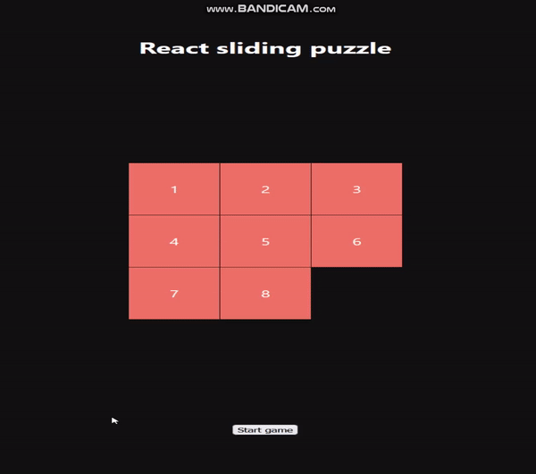
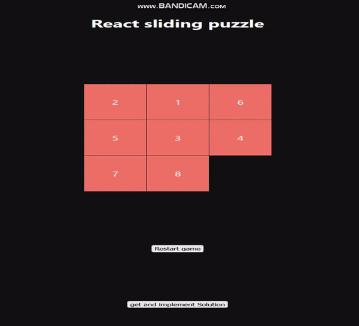

# 8-Tile-Puzzle-with-bidirectional-search
implementation of 8 tile puzzle and a solver which works on bidirectional search. Frontend based on react, Backend on Django

## Pre-Requisites
react and django are the basic frontend and backend for this project

## Usage
Clone the repo, navigate into the main directory

To setup frontend, run:
```bash
npm install
```
After all dependencies are installed, start the server:
```bash
npm start
```
  
If everything works per plan, you should see the following webpage


next, start the backend django server:
```bash
python manage.py runserver
```

now, you can press start game to shuffle the tiles


If you want the search to solve itself, repeatedly press 'get and implement solution' button to solve each step



Happy solving!
